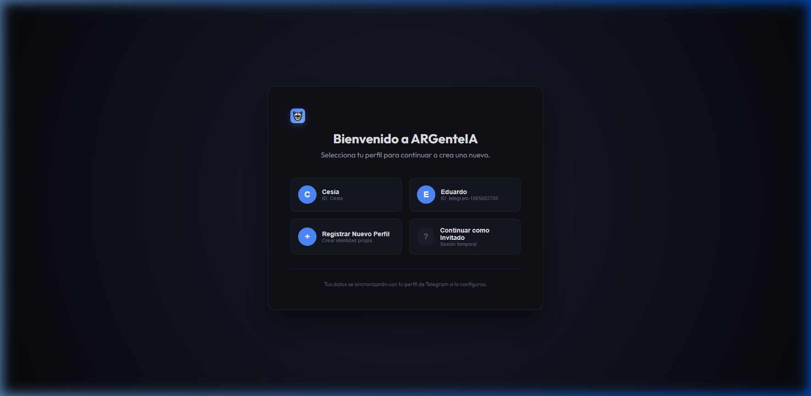
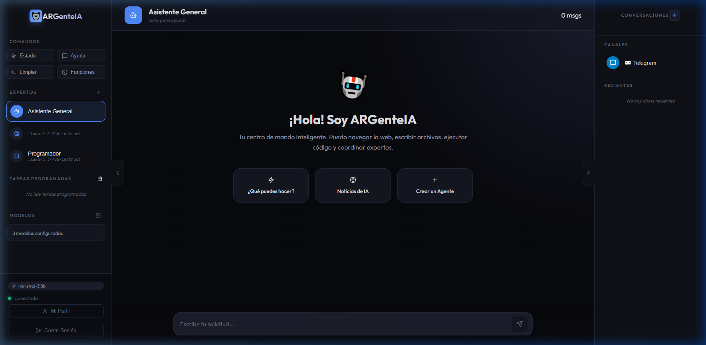
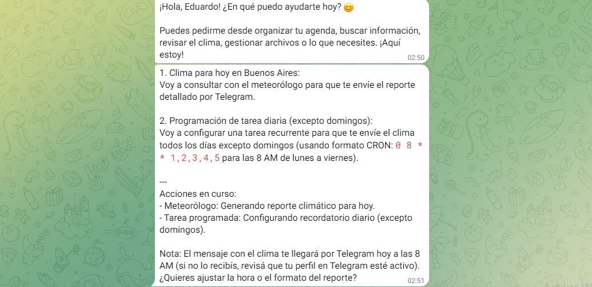
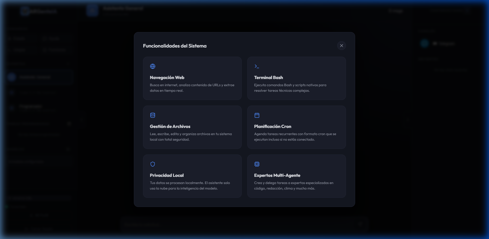

# 🤖 ARGenteIA `v1.7.0`

### El Asistente Personal que Vive en tu PC

ARGenteIA es mucho más que un simple chatbot. Es un ecosistema de IA diseñado para correr localmente, dándote control total sobre tus datos, tus herramientas y tus automatizaciones. Atiéndelo desde tu navegador o llévalo contigo en Telegram.

---

## ✨ Características Principales

*   **🏠 100% Local o Cloud:** Tú eliges. Conéctalo a **Ollama** para privacidad total o a **OpenRouter/OpenAI** para máxima potencia.
*   **🧠 Memoria Infinita:** No solo recuerda la charla actual. El asistente puede "memorizar" datos sobre ti (tus gustos, fechas importantes, notas) que persisten para siempre.
*   **🤖 Sistema de Expertos (Multi-Agente):** Crea agentes especializados para tareas específicas: un experto en programación, un asistente de cocina o un analista financiero.
*   **🐚 Terminal Inteligente:** Pídele que ejecute comandos, instale paquetes o analice logs. Soporta **Windows (PowerShell)** y **Linux (Bash)**.
*   **📅 Automatización CRON:** Programa tareas para que el asistente las haga por ti mientras duermes (reportes, recordatorios, monitoreo).
*   **📱 Multi-Canal Nativo:** Chatea con una interfaz Web moderna y premium o usa el bot de **Telegram** para enviarte archivos y comandos desde cualquier lugar.

---

## 📸 Experiencia de Usuario

| Login | WebChat Premium |
| :--- | :--- |
|  |  |
|  |  |

*Interfaz diseñada con estética **Glassmorphism Dark**, optimizada para enfoque y productividad.*

---

## 🛠️ Lo que ARGenteIA puede hacer por ti

- **"Avísame todos los lunes a las 9am que revise el presupuesto."** *(Automatización)*
- **"Busca en la web las últimas noticias de IA y resúmelas en un archivo .txt."** *(Herramientas)*
- **"¿Recuerdas cuál era mi café favorito?"** *(Memoria Long-term)*
- **"Toma una captura de pantalla de mi escritorio y envíamela por Telegram."** *(Control remoto)*

---

## 🏁 Inicio Rápido

¿Quieres probarlo? Solo necesitas Node.js y 5 minutos:

```bash
pnpm install
cp config.example.json config.json
pnpm dev
```

> [!TIP]
> Para una guía detallada de instalación y configuración técnica, consulta nuestro [**Documento Técnico (TECHNICAL.md)**](./docs/TECHNICAL.md).

---

## 📂 Documentación Adicional

- [**Guía Técnica**](./docs/TECHNICAL.md): Arquitectura, Instalación y Configuración.
- [**Guía de Archivos**](./docs/GUIA_ARCHIVOS.md): Entiende cómo funciona el código por dentro.

---

## 📄 Licencia

Este proyecto está bajo la licencia **MIT**. Eres libre de usarlo, modificarlo y distribuirlo para tus propios fines.

---

<p align="center">
  Hecho con ❤️ para la comunidad de IA local.
</p>
