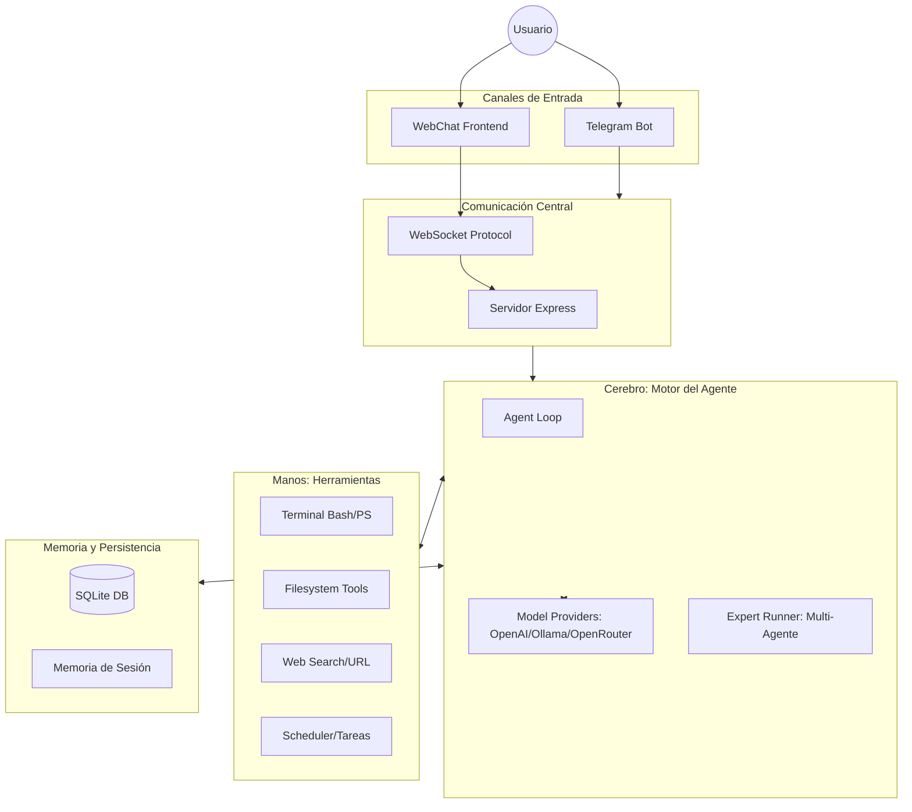

# 📖 Guía de Arquitectura: ARGenteIA

Este documento explica la estructura interna, los flujos de datos y la lógica detrás del asistente **ARGenteIA**.

---

## 🏗️ Resumen de Arquitectura

El sistema está diseñado bajo una arquitectura de **Agente Autónomo** con múltiples canales de entrada y un sistema extensible de herramientas.

---

## 📂 Desglose de Carpetas y Flujos

### 1. Punto de Entrada (`src/index.ts`)
Es el encargado de encender el motor. Realiza cuatro acciones críticas:
1. Carga y valida la configuración (`config.json`).
2. Inicializa la base de datos **SQLite**.
3. Registra todas las **Herramientas** disponibles.
4. Arranca el **Gateway** (Web) y el Bot de **Telegram**.

### 2. Gateway y Protocolo (`src/gateway/`)
Funciona como el puente entre el mundo exterior y la lógica del Agente.
- **`server.ts`**: Levanta un servidor Express que sirve el frontend y maneja conexiones WebSocket para el chat en tiempo real.
- **`protocol.ts`**: Define el lenguaje común (JSON) que hablan el cliente y el servidor (mensajes de texto, indicadores de escritura, actualizaciones de estado).

### 3. Canales (`src/channels/`)
Manejan la idiosincrasia de cada plataforma:
- **`telegram.ts`**: Traduce los mensajes de Telegram al formato del Agente y maneja comandos específicos como `/start`, `/model`, etc. Posee un sistema de fallbacks para cuando el formato Markdown falla.
- **`webchat.ts`**: Gestiona la lógica específica de la interfaz web, incluyendo la carga de historial persistente cuando un usuario se identifica.

### 4. El Cerebro (`src/agent/`)
Aquí reside la magia. El Agente no solo "responde", sino que "piensa" en ciclos.
- **`loop.ts`**: Controla el ciclo de razonamiento (ReAct). Si el modelo decide usar una herramienta, el loop la ejecuta, obtiene el resultado y vuelve a llamar al modelo hasta que tenga una respuesta final.
- **`models.ts`**: Detecta automáticamente si debe usar OpenAI, Anthropic u Ollama. Es el que permite la flexibilidad de modelos.
- **`expert-runner.ts`**: Permite delegar tareas a "Expertos". Cada experto es como un sub-agente con su propio prompt especializado y herramientas limitadas.

### 5. Herramientas (`src/tools/`)
Son las capacidades del asistente. Cada herramienta tiene un **Spec** (que la IA lee para saber cómo usarla) y un **Handler** (el código Typescript que hace el trabajo real).
- **Bash**: Ejecuta comandos reales en tu PC.
- **MemoryTools**: Permite al asistente "recordar" datos sobre vos permanentemente (`memorize_fact`, `recall_facts`).
- **Scheduler**: Gestiona tareas que se ejecutan en el futuro vía cron.

### 6. Memoria (`src/memory/`)
Usa SQLite para persistencia:
- **`message-db.ts`**: Guarda cada mensaje para que no se pierdan al reiniciar.
- **`user-db.ts`**: Gestiona perfiles de usuario y preferencias.
- **`expert-db.ts`**: Guarda la configuración de tus agentes personalizados.

---

## 🔄 El Ciclo de Vida de un Mensaje

1. **Entrada**: El usuario escribe "Busca el clima en Buenos Aires" por Telegram.
2. **Recepción**: `telegram.ts` captura el mensaje e identifica al usuario.
3. **Invocación**: Se llama a `runAgent` en `loop.ts`.
4. **Razonamiento (Paso 1)**: El modelo (ej: llama3) responde: *"Necesito usar la herramienta 'weather' para Buenos Aires"*.
5. **Ejecución**: El sistema ejecuta el handler de la herramienta `weather`.
6. **Razonamiento (Paso 2)**: El Agente recibe el resultado ("22°C y nublado") y genera la respuesta final en español.
7. **Salida**: El canal (Telegram) envía el texto final al usuario junto con las métricas de tiempo y tokens.

---

## 🛠️ Tecnologías Utilizadas

- **Backend**: Node.js v22+ con Typescript (tsx).
- **IA SDK**: OpenAI SDK (compatible con OpenRouter y Ollama).
- **Base de Datos**: Better-SQLite3.
- **Frontend**: React + Vite + Lucide Icons.
- **Comunicación**: WebSockets (ws) y Express.
- **Estética**: Chalk para logs coloridos en terminal y CSS Premium en el chat.
