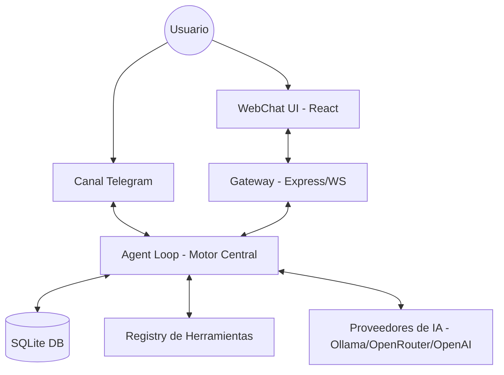

# ⚙️ Guía Técnica de ARGenteIA

Este documento contiene los detalles técnicos, instrucciones de instalación, configuración avanzada y arquitectura del sistema para desarrolladores o usuarios avanzados.

---

## 🏗️ Arquitectura del Sistema

ARGenteIA funciona como un middleware inteligente entre el usuario y los Modelos de Lenguaje (LLMs).



---

## 🚀 Instalación y Despliegue

### Requisitos Previos
- **Node.js:** Versión 22 o superior.
- **PNPM:** El gestor de paquetes recomendado (`npm install -g pnpm`).
- **Ollama (Opcional):** Si deseas ejecutar modelos 100% locales.

### Pasos
1. **Clonar el repositorio:**
   ```bash
   git clone <url-del-repo>
   cd asistentePersonal
   ```
2. **Instalar dependencias:**
   ```bash
   pnpm install
   ```
3. **Configuración inicial:**
   Copia el archivo de ejemplo y edítalo con tus credenciales.
   ```bash
   cp config.example.json config.json
   ```
4. **Ejecución en desarrollo:**
   ```bash
   pnpm dev
   ```

---

## 🛠️ Configuración (`config.json`)

El archivo de configuración utiliza **Zod** para validación en tiempo de ejecución.

### Ejemplo de Configuración Bash (Windows vs Linux)
```json5
"tools": {
  "bash": {
    "enabled": true,
    "os": "windows", // Cambiar a "linux" en sistemas Unix
    // Opcional: Ruta al ejecutable de PowerShell si no está en el PATH
    "psExe": "C:\\Windows\\System32\\WindowsPowerShell\\v1.0\\powershell.exe",
    "allowlist": ["ls", "cat", "echo", "pwd"] // Comandos permitidos
  }
}
```

---

## 📋 Protocolo WebSocket (`src/gateway/protocol.ts`)

La comunicación entre la UI y el servidor se basa en mensajes JSON con un campo `type`. Algunos tipos clave son:

- `user_message`: Envío de texto del usuario.
- `assistant_message`: Respuesta final del asistente con historial y metadatos.
- `action_log`: Logs en tiempo real sobre el uso de herramientas o estados internos.
- `status`: Información de sesión e inicialización del cliente.
- `list_chats`: Recuperación del historial de conversaciones del usuario.

---

## 🗄️ Esquema de Base de Datos (`src/memory/db.ts`)

Se utiliza SQLite con el driver `better-sqlite3`. Las tablas principales son:

- `users`: Perfiles, zonas horarias y tokens de acceso.
- `messages`: Registro histórico de todos los chats.
- `chats`: Agrupación de mensajes por contexto y experto.
- `user_facts`: Memoria a largo plazo (recuerdos).
- `scheduled_tasks`: Tareas CRON persistentes.
- `sub_agents`: Configuración de expertos personalizados.

---

## 🔧 Extensibilidad: Tools y Skills

### Añadir una nueva herramienta
1. Crea un archivo en `src/tools/tu-herramienta.ts`.
2. Define el esquema compatible con OpenAI (Spec).
3. Implementa el `handler` (lógica en TypeScript).
4. Regístrala en `src/tools/index.ts`.

### Añadir una Skill
Simplemente añade un archivo `.md` en la carpeta `skills/` en la raíz. El contenido de este archivo se inyectará automáticamente en el prompt del sistema durante el inicio.

---

## 📡 Canales de Comunicación

- **Telegram:** Implementado con `node-telegram-bot-api`. Soporta Webhooks o Polling (default).
- **WebChat:** Aplicación Single Page (SPA) en `ui/` construida con React, Vite y WebSockets.
